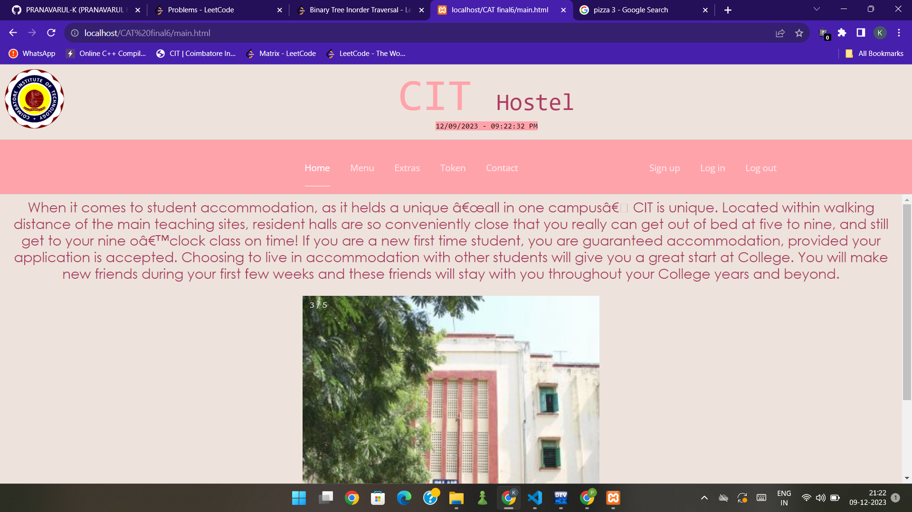
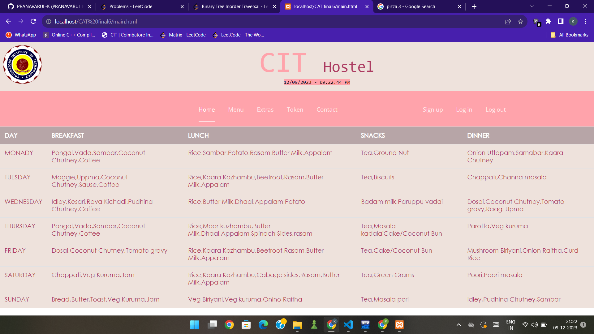
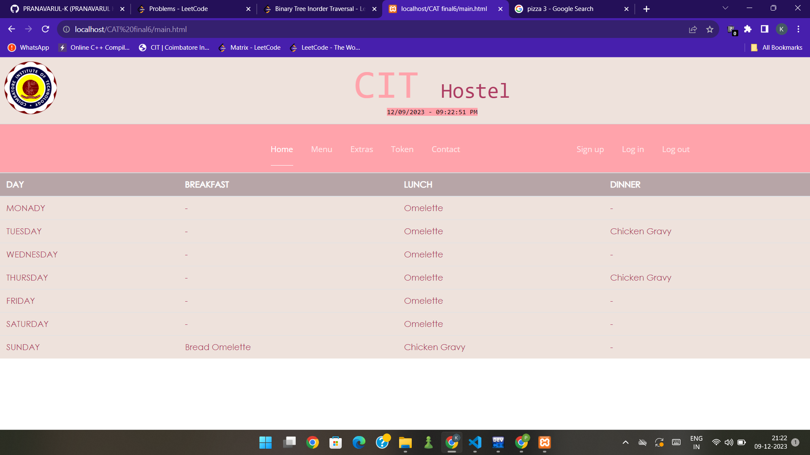
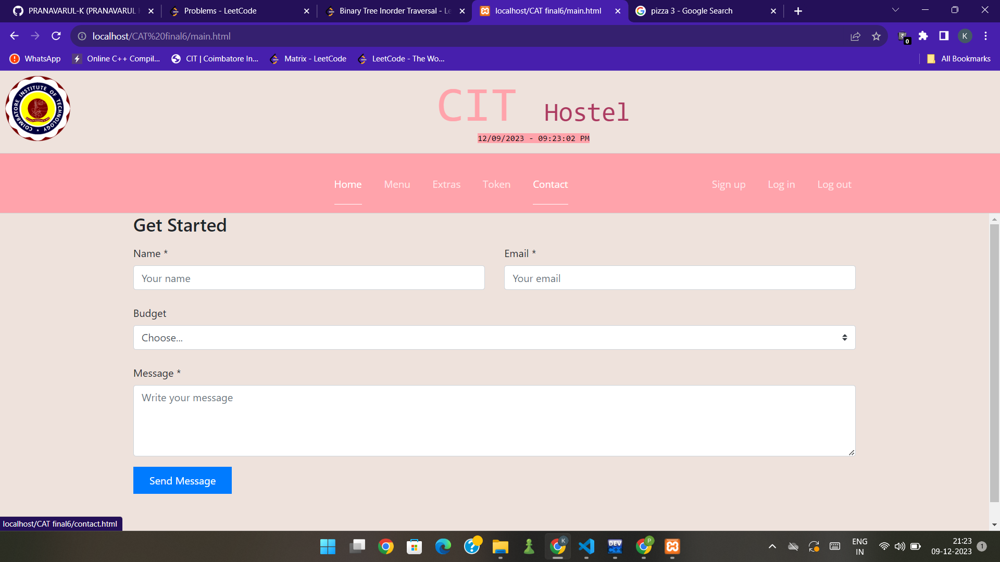
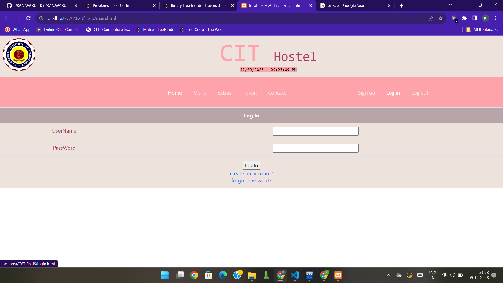
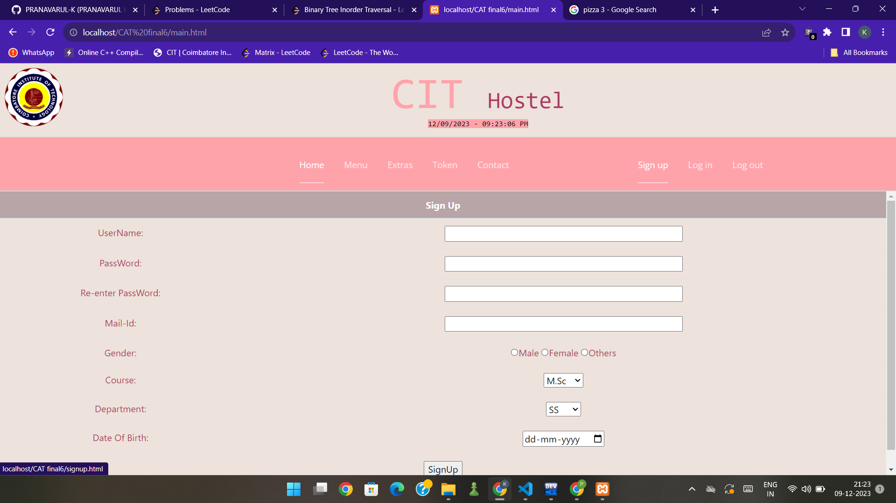

# Hosteller

Hosteller is a web application designed to streamline the process of availing non-veg food tokens in the mess, ultimately saving valuable time for students. The application provides a user-friendly interface where students can authenticate, view today's menu, and generate random token numbers for non-veg meals.

## Technologies Used

- **HTML, CSS, JS:** For the front-end development of the web application.
- **PHP:** Server-side scripting language for dynamic content.
- **MySQL:** Database management system for storing student and token information.
- **Bootstrap:** Front-end framework for responsive and attractive design.

## Features

- **User Authentication:**
  - Students can log in using their credentials or sign up if they are new users.
  - Password recovery option (forgot password).

- **Home Page:**
  - Displays a list of hostels in Coimbatore Institute of Technology.
  - Shows today's menu in the mess.

- **Token System:**
  - Students can avail non-veg food tokens.
  - Random token number generation for each user.

- **File Structure:**
  - `Home.html`: Home page displaying hostels and today's menu.
  - `nav.html`: Navigation bar for consistent UI.
  - `signup.html`: User registration page.
  - `login.html`: Login page for authentication.
  - `menu.html`: Page displaying today's menu.
  - `token.html`: Page for availing non-veg food tokens.
  - `forgotpass.html`: Password recovery page.
  - `contact.html`: Contact page.

  - PHP Files:
    - `log.php`: PHP script for user login.
    - `sign.php`: PHP script for user registration.
    - `logout.php`: PHP script for user logout.

## Getting Started

Follow the steps below to get started:

1. **Clone the Repository:**
   ```bash
   git clone https://github.com/PRANAVARUL-K/Hosteller.git
   ```

2. **Start Apache Server on XAMPP:**
   - Open XAMPP control panel.
   - Start the Apache server by clicking the "Start" button next to Apache.

3. **Set Up Database:**
   - Open PhpMyAdmin by visiting [http://localhost/phpmyadmin/](http://localhost/phpmyadmin/) in your browser.
   - Execute the provided SQL commands in the SQL tab to create the necessary database and tables.
   **Database Setup Commands:**

  ```sql
  -- Create a database
  CREATE DATABASE IF NOT EXISTS signup;

  -- Use the created database
  USE signup;

  -- Create sign table
  CREATE TABLE IF NOT EXISTS sign (
    id INT AUTO_INCREMENT PRIMARY KEY,
    u_name VARCHAR(255) NOT NULL,
    pass VARCHAR(255) NOT NULL,
    email VARCHAR(255) NOT NULL,
    stat CHAR(1) DEFAULT 'n',
    token CHAR(3) DEFAULT 'no'
);
--
  ```

4. **Open the Web Application:**
   - Place the cloned repository in the `htdocs` directory of your XAMPP installation.
   - Open your web browser and visit [http://localhost/hosteller](http://localhost/hosteller).

## Images
**Wait For The Images To Load**








Now you can explore, contribute, and enhance the Hosteller project to suit the specific needs of your institution. Happy coding!
